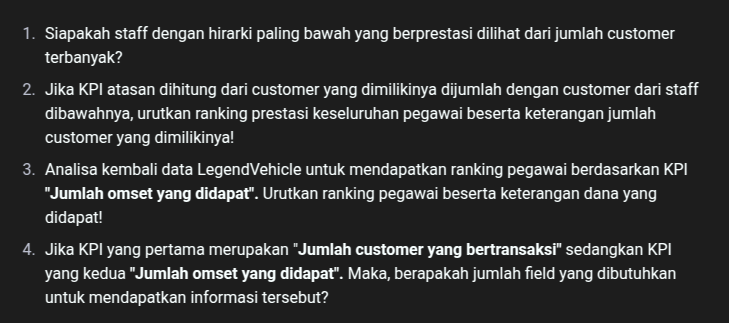

# Tugas 1

1. Import data perusahaan tersebut pada DBMS MySQL!
2. Analisa struktur data dari database perusahaan tersebut, dalam bentuk tabel, analisa hubungan setiap tabel nya!
3. Analisa jumlah field pada setiap tabel!

## Answer

1. 
2. Table

| Table 1      | Table 2      | Relation    |
| ------------ | ------------ | ----------- |
| productlines | products     | one to many |
| customers    | employees    | many to one |
| employees    | offices      | many to one |
| orders       | orderdetails | one to one  |
| orderdetails | products     | many to one |
| orders       | customers    | one to many |
| payments     | customers    | many to one |

3. Table

| Table        | Fields |
| ------------ | ------ |
| productlines | 4      |
| products     | 9      |
| customers    | 13     |
| employees    | 8      |
| offices      | 9      |
| orders       | 10     |
| orderdetails | 5      |
| payments     | 4      |

---
# Praktikum

## Query sql yang benar

Praktikum 1

```sql
SELECT
    *
FROM
    classicmodels.employees AS employee,
    classicmodels.employees AS manager,
	classicmodels.customers AS cust
WHERE
    employee.reportsTo = manager.employeeNumber
    AND employee.employeeNumber = cust.salesRepEmployeeNumber;
```
Praktikum 2

```sql
SELECT
    manager.employeeNumber AS id_manager,
    CONCAT(manager.firstName, " ", manager.lastName) AS Manager,
    employee.employeeNumber AS id_staff,
    CONCAT(employee.firstName, " ", employee.lastName) AS staff
FROM classicmodels.employees AS employee
JOIN classicmodels.employees AS manager
    ON employee.reportsTo = manager.employeeNumber
ORDER BY manager.firstName;
```

# Tugas 2

1. Gambarlah hirarki organisasi berdasarkan atasan dari setiap pegawai sesuai dengan hasil prkatikum diatas!

```py
# hirarki dalam bentuk tree
Diane Murphy (1002)
 ├── Jeff Firrelli (1076)
 ├── Mary Patterson (1056)
 │    ├── Anthony Bow (1143)
 │    │    ├── Leslie Jennings (1165)
 │    │    ├── Leslie Thompson (1166)
 │    │    ├── Julie Firrelli (1188)
 │    │    ├── Steve Patterson (1216)
 │    │    ├── Foon Yue Tseng (1286)
 │    │    ├── George Vanauf (1323)
 │    ├── Gerard Bondur (1102)
 │    │    ├── Martin Gerard (1702)
 │    │    ├── Barry Jones (1504)
 │    │    ├── Larry Bott (1501)
 │    │    ├── Pamela Castillo (1401)
 │    │    ├── Gerard Hernandez (1370)
 │    │    ├── Loui Bondur (1337)
 │    ├── Mami Nishi (1621)
 │         ├── Yoshimi Kato (1625)
 │    ├── William Patterson (1088)
 │         ├── Andy Fixter (1611)
 │         ├── Peter Marsh (1612)
 │         ├── Tom King (1619)
```
# Tugas 3



## Pertanyaan Analisis Data Pegawai

### 1. Staff dengan Hirarki Paling Bawah yang Berprestasi
Staff dengan hirarki paling bawah yang memiliki jumlah customer terbanyak adalah **Pamela Castillo (1401)** dengan **10 customer**.

### 2. Ranking Pegawai Berdasarkan KPI "Jumlah Customer yang Bertransaksi"
Urutan pegawai berdasarkan jumlah customer yang dimiliki, termasuk akumulasi dari bawahan:

| ID Pegawai | Nama Pegawai         | Total Customer Langsung | Total Dari Bawahan | Total KPI |
|------------|----------------------|-------------------------|--------------------|-----------|
| 1102       | Gerard Bondur        | 46                      | 0                  | 46        |
| 1143       | Anthony Bow          | 39                      | 0                  | 39        |
| 1088       | William Patterson    | 10                      | 0                  | 10        |
| 1056       | Mary Patterson       | 5                       | 49                 | 54        |
| 1002       | Diane Murphy         | 0                       | 93                 | 93        |

**Ranking Tertinggi:** Diane Murphy (93 customer)
**Ranking Terendah:** Jeff Firrelli, Yoshimi Kato, dll. (0 customer)

### 3. Ranking Pegawai Berdasarkan KPI "Jumlah Omset yang Didapat"
Untuk menghitung KPI berdasarkan jumlah omset, kita dapat menggunakan query berikut:

```sql
SELECT
    emp.employeeNumber,
    CONCAT(emp.firstName, ' ', emp.lastName) AS employee_name,
    SUM(ord.amount) AS total_revenue
FROM employees AS emp
JOIN customers AS cust ON emp.employeeNumber = cust.salesRepEmployeeNumber
JOIN orders AS ord ON cust.customerNumber = ord.customerNumber
GROUP BY emp.employeeNumber
ORDER BY total_revenue DESC;
```

Pegawai dengan omset tertinggi akan berada di urutan pertama berdasarkan hasil query di atas.

### 4. Jumlah Field yang Dibutuhkan untuk KPI
Untuk mendapatkan kedua KPI (**Jumlah Customer yang Bertransaksi** & **Jumlah Omset yang Didapat**), minimal dibutuhkan **3 field**:

| Field          | Keterangan                                         |
|---------------|-------------------------------------------------|
| `employeeNumber` | ID unik pegawai                             |
| `total_customers` | Jumlah customer yang dimiliki pegawai       |
| `total_revenue` | Total omset yang diperoleh pegawai         |

Jika ingin menyimpan **struktur hierarki** lebih detail, kita bisa menambahkan **2 field tambahan**:

| Field             | Keterangan                                         |
|------------------|-------------------------------------------------|
| `reportsTo`      | ID atasan langsung pegawai                     |
| `cumulative_customers` | Total customer pegawai + bawahan (KPI 1) |
| `cumulative_revenue` | Total omset pegawai + bawahan (KPI 2) |

Sehingga total **minimal 3 field**, dan jika ingin menyimpan hierarki KPI, totalnya menjadi **5 field**.
